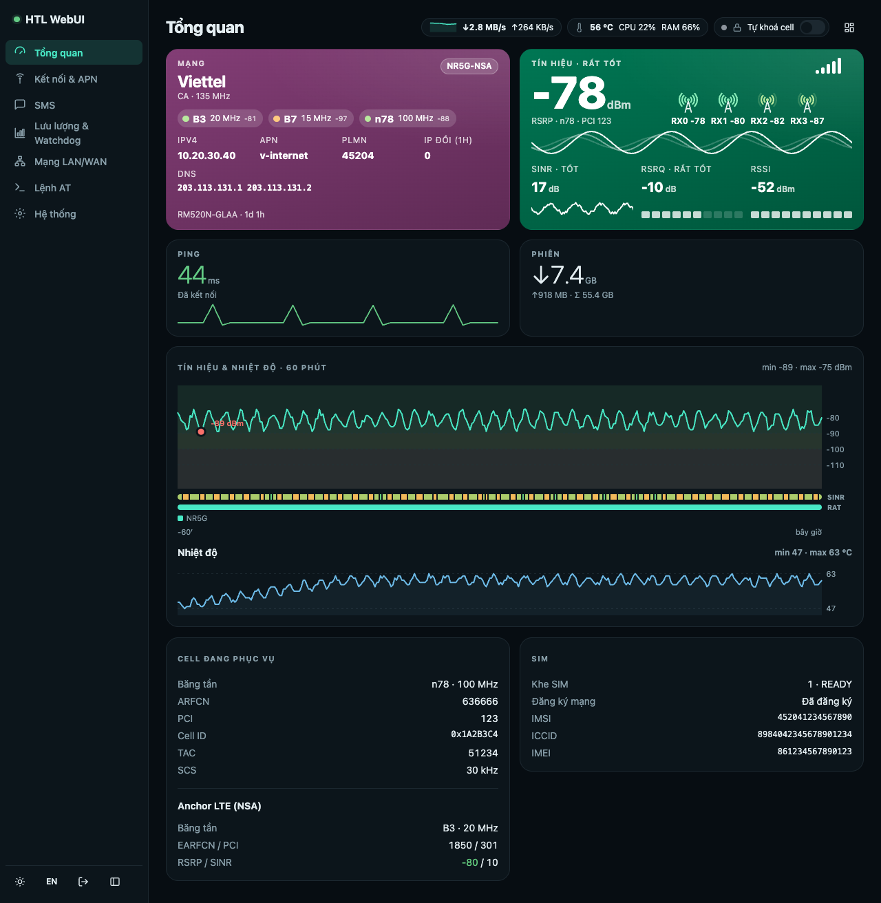
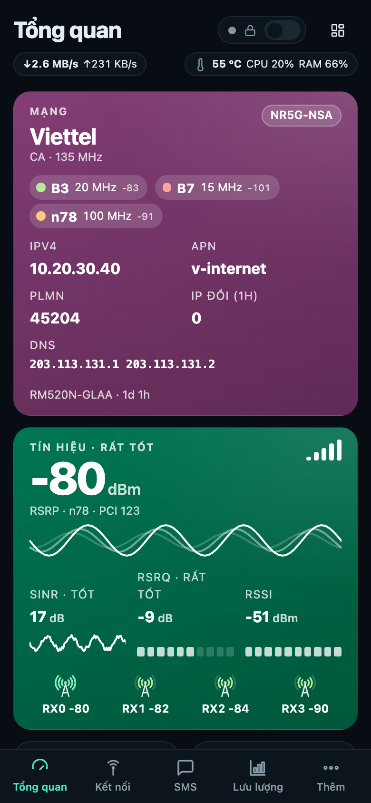
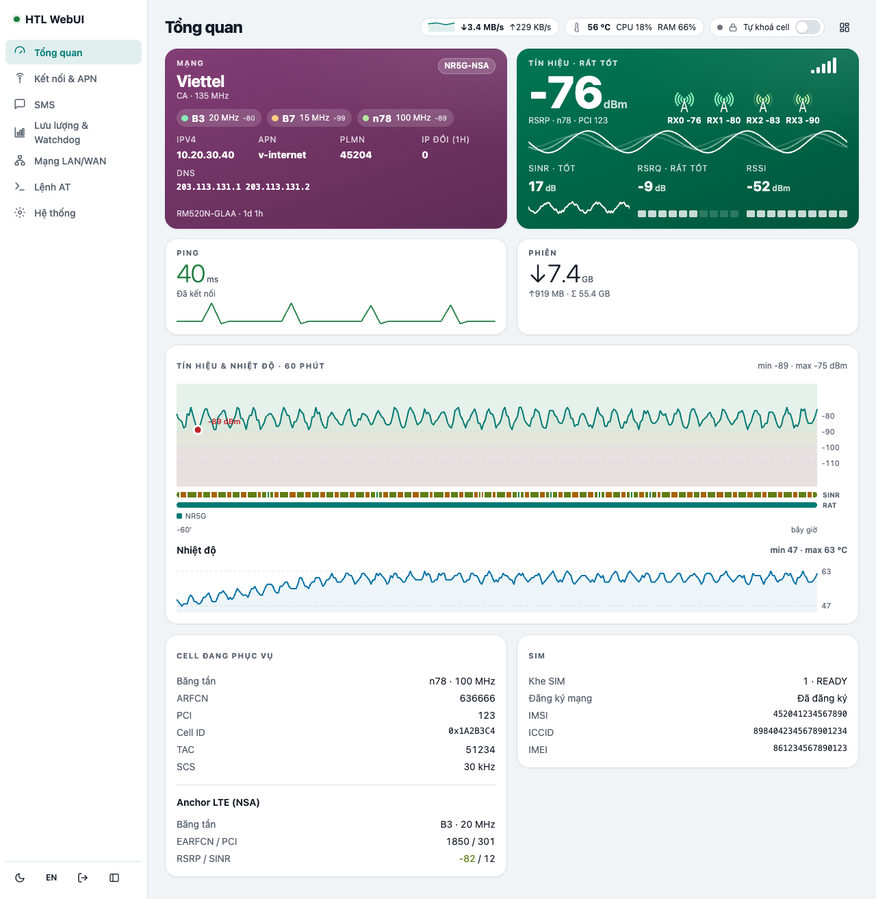
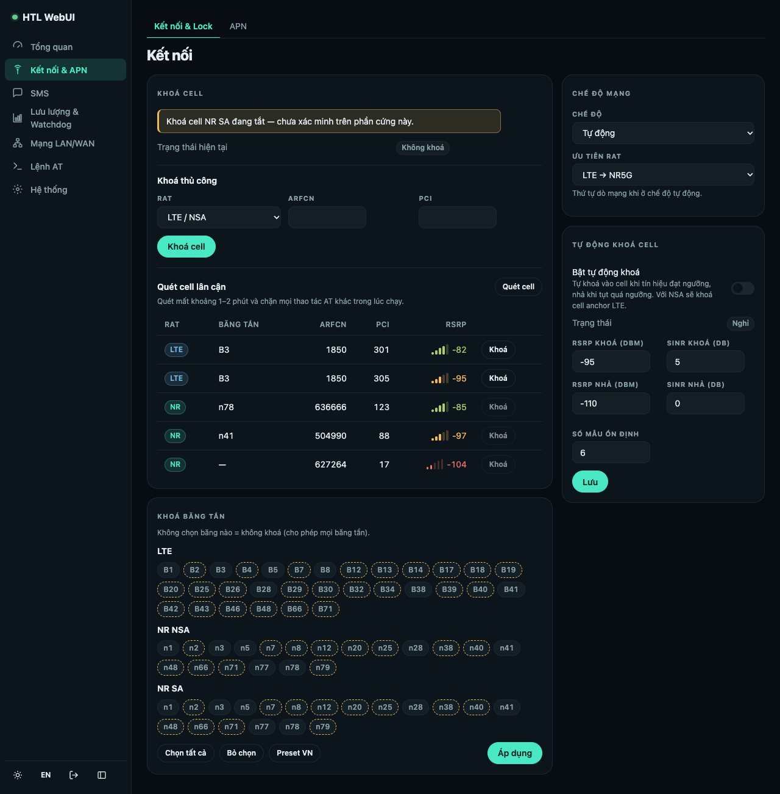
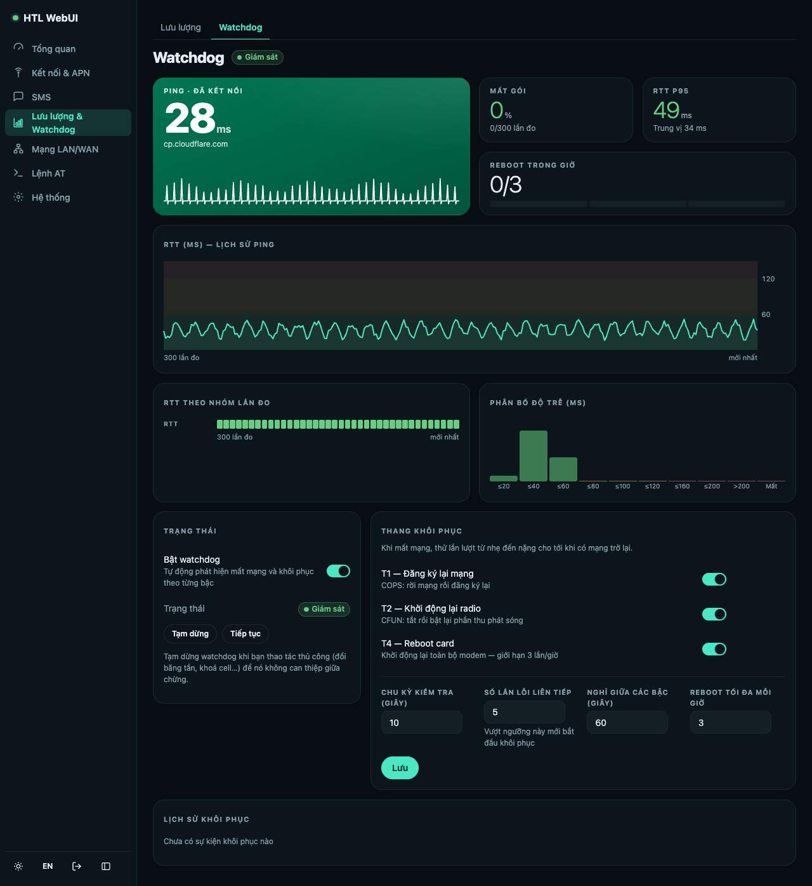
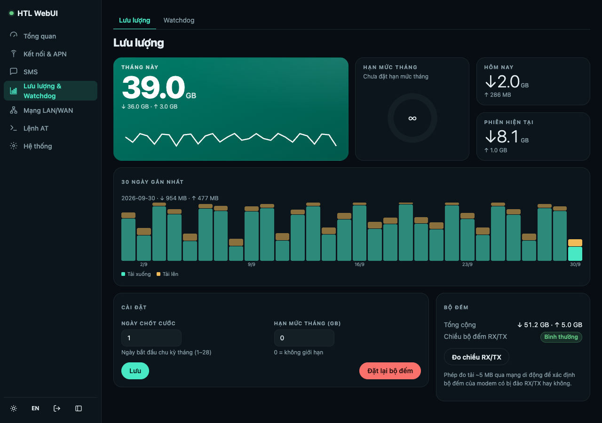
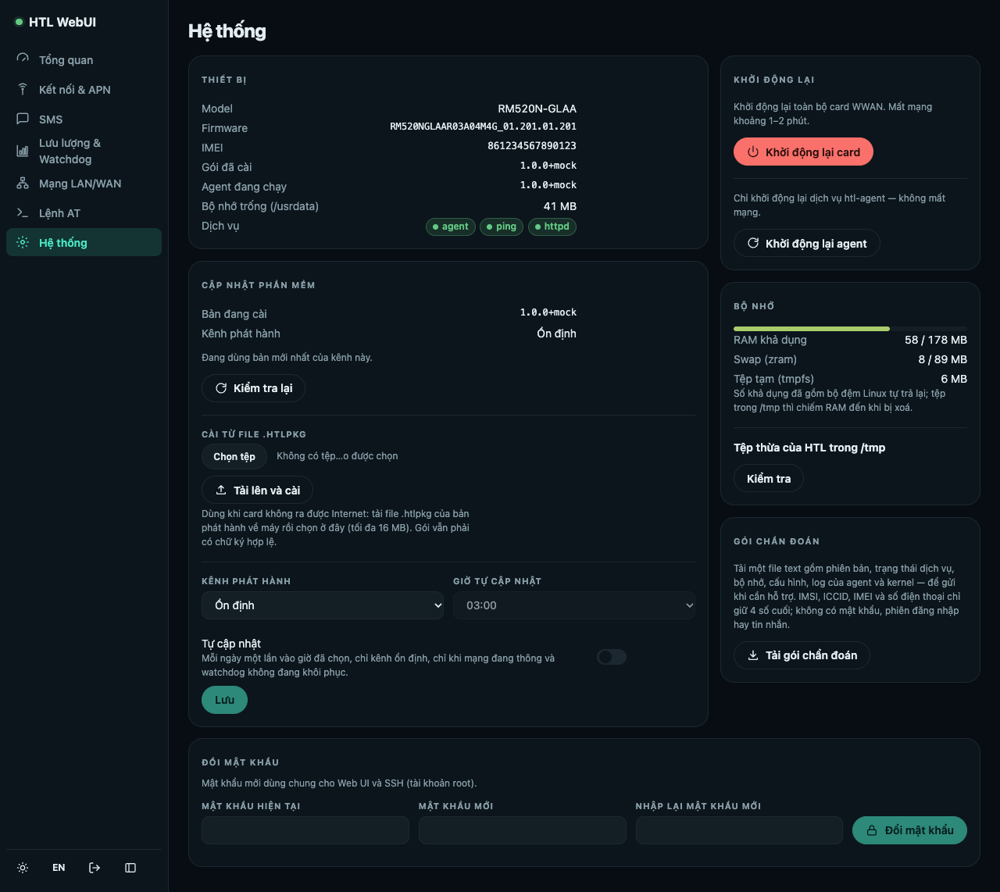

# HTL Quectel WebUI

Giao diện web cho card 5G **Quectel RM520N** (dòng RM5xx, firmware Quectel gốc): tín hiệu vẽ
thành hình, khoá band/cell, tự động khoá cell, APN, SMS, lưu lượng, watchdog tự khôi phục kết
nối, quản lý bộ nhớ, đổi IP LAN của card, cập nhật OTA có ký số. Chạy ngay trên card, không cần
máy chủ riêng.

Repo này chỉ chứa **bản phát hành đã ký** và **script cài đặt**.



<table>
<tr>
<td width="30%"></td>
<td></td>
</tr>
<tr>
<td align="center">Điện thoại</td>
<td align="center">Giao diện sáng (tự theo cài đặt của máy)</td>
</tr>
</table>

<table>
<tr>
<td></td>
<td></td>
</tr>
<tr>
<td align="center">Kết nối: quét cell, khoá cell/băng tần</td>
<td align="center">Watchdog: ping, độ trễ, thang khôi phục, nhật ký sự cố</td>
</tr>
<tr>
<td></td>
<td></td>
</tr>
<tr>
<td align="center">Lưu lượng: tháng, 30 ngày, hạn mức</td>
<td align="center">Hệ thống: cập nhật, bộ nhớ, chẩn đoán</td>
</tr>
</table>

<sub>Ảnh chụp từ dữ liệu mô phỏng, không phải từ card thật.</sub>

## Chức năng

| Trang | Làm được gì |
|---|---|
| **Tổng quan** | Nhà mạng, RAT, từng sóng mang CA (băng, độ rộng, RSRP riêng); RSRP/SINR/RSRQ/RSSI vẽ thành sóng và vạch, RSRP của 4 ăng-ten RX; biểu đồ 60 phút tín hiệu + nhiệt độ kèm dải SINR và RAT; ping, lưu lượng phiên, tốc độ đang chạy, nhiệt độ/CPU/RAM; cell đang phục vụ và anchor LTE (NSA); SIM, IMEI. Thẻ màu đổi theo chất lượng sóng; kéo thả để sắp xếp. |
| **Kết nối** | Quét cell lân cận; khoá cell LTE/NR (chọn từ kết quả quét hoặc nhập tay); khoá băng tần LTE, NR NSA, NR SA (có preset VN); chế độ mạng và thứ tự ưu tiên RAT; **tự khoá cell** khi tín hiệu đạt ngưỡng, tự nhả khi tụt. |
| **APN** | Sửa 6 cấu hình PDP (APN, loại IP, xác thực), bật/tắt từng CID, preset nhà mạng. |
| **SMS** | Đọc, gửi, xoá tin; hiển thị đúng tiếng Việt (UCS-2) và tin từ số ngắn; tra tài khoản bằng USSD (`*101#`…). |
| **Lưu lượng** | Tháng này, hôm nay, phiên hiện tại; biểu đồ 30 ngày tải xuống/lên; ngày chốt cước, hạn mức tháng; kiểm tra bộ đếm modem có bị đảo RX/TX không. |
| **Watchdog** | Ping liên tục, mất gói, RTT P95, phân bố độ trễ. Mất mạng thì khôi phục theo bậc: đăng ký lại mạng → khởi động lại radio → reboot card (giới hạn số lần/giờ). Nhận biết SIM bị nhà mạng từ chối để không reboot vô ích; tự kéo card về 4G/5G khi bị kẹt ở 3G; tự nhả khoá cell của autolock khi mất mạng trên cell đó; tự nhường khi bạn đang thao tác tay; tạm dừng được. **Nhật ký sự cố** (mất/có mạng, xuống 3G, mỗi lần khôi phục) lưu trên card, còn nguyên sau reboot. |
| **Mạng LAN/WAN** | IP LAN (gateway) của card, DNS tuỳ chỉnh cho máy trong LAN, TTL/Hop Limit, IP Passthrough (Ethernet/USB). |
| **Lệnh AT** | Bảng lệnh gửi thẳng tới modem (tắt sẵn, bật khi cần; mọi lệnh ghi vào log), danh sách lệnh thường dùng theo nhóm kèm giải thích tham số. |
| **Hệ thống** | Cập nhật OTA từ repo này (kiểm chữ ký, tự quay về bản cũ nếu bản mới không chạy), tự cập nhật theo giờ, cài từ file `.htlpkg` khi card không ra Internet; RAM, zram và dọn tệp thừa trong `/tmp`; tải gói chẩn đoán (đã che IMSI/ICCID/IMEI/số điện thoại); khởi động lại card hoặc agent; đổi mật khẩu (dùng chung cho SSH). |

Tiếng Việt/English, giao diện sáng/tối, dùng tốt trên điện thoại. Toàn bộ giao diện khoảng 72 KB
(nén), chạy ngay trên card cùng một agent viết bằng Rust — không cần máy chủ hay dịch vụ đám mây.

### Card nào cài được

| Model | |
|---|---|
| RM520N, RM521F, RM530N (SDX6x) | cài được; RM520N-GL đã chạy thật |
| RM500Q, RM502Q, RM505Q, RM510Q (SDX55) | cài kèm cảnh báo: cùng hệ điều hành, **chưa thử trên phần cứng** |
| RM551E, RM500U | không hỗ trợ (hệ điều hành khác) |
| model khác | dừng; thêm `--any-model` nếu vẫn muốn cài |

## Cài đặt

Cần: card đã có mạng (data call lên), cắm USB **có bật ADB**, còn khoảng 40 MB trống ở
`/usrdata`. Chọn một cách, tuỳ card đang cắm vào đâu:

### Router có ứng dụng Rowa

Trong ứng dụng: **Cài đặt → Web UI của card 5G → Cài** (hoặc từ thẻ 5G). Rowa chạy đúng
`router-install.sh` ở Cách 1 và hiện tiến độ; cập nhật, quay về bản cũ, kênh và giờ tự cập nhật
cũng làm được ở đó.

### Cách 1 — Card cắm vào router OpenWrt (khuyên dùng)

SSH vào router bằng root rồi dán:

```sh
wget -qO- https://raw.githubusercontent.com/tuanlongsav/htl-webui-releases/main/router-install.sh | sh
```

Script tự cài `adb` lên router nếu thiếu (opkg hoặc apk), tìm card, cài lên card, rồi in địa chỉ
Web UI. Lần đầu mất khoảng 3–5 phút.

### Cách 2 — Card cắm vào máy tính có adb (Windows, macOS, Linux)

```sh
adb shell "curl -fsSL -o /tmp/b.sh https://raw.githubusercontent.com/tuanlongsav/htl-webui-releases/main/bootstrap.sh && sh /tmp/b.sh"
```

Windows: cài [Android Platform Tools](https://developer.android.com/tools/releases/platform-tools)
để có `adb`, dán nguyên dòng trên vào Command Prompt hoặc PowerShell.

### Cách 3 — Đã vào được shell của card (`adb shell`, ssh)

```sh
curl -fsSL -o /tmp/b.sh https://raw.githubusercontent.com/tuanlongsav/htl-webui-releases/main/bootstrap.sh && sh /tmp/b.sh
```

### Tuỳ chọn

| Tuỳ chọn | Tác dụng |
|---|---|
| `--dry-run` | chỉ kiểm tra (card, mạng, chữ ký bản phát hành), không cài gì |
| `--force` | cài lại dù card đã có bản này hoặc mới hơn |
| `--fresh` | card đã có HTL: xoá sạch bản cài cũ (cả cấu hình, mật khẩu, chứng chỉ, bộ đếm) rồi cài lại từ đầu |
| `--channel beta` | lấy bản thử nghiệm thay vì bản ổn định |
| `--lan-ip 192.168.50.1` | đặt IP LAN (gateway) của card khi cài; bỏ trống thì giữ nguyên. Đổi về sau: trang Mạng LAN/WAN |
| `--any-model` | cài trên model không có trong bảng ở trên |
| `--status` | chỉ xem: card, bản đang cài, trạng thái Web UI |
| `--uninstall [--keep-data]` | gỡ cài đặt (xem bên dưới) |
| `--serial S` (chỉ Cách 1) | chọn card khi router thấy nhiều thiết bị adb |

Cách 1: `wget -qO- …/router-install.sh | sh -s -- --dry-run`. Cách 2 và 3: `sh /tmp/b.sh --dry-run`.

Dòng cuối luôn dành cho chương trình: `HTL-INSTALL: OK code=… url=…` hoặc
`HTL-INSTALL: FAILED code=… — lý do` (Cách 1), `HTL-BOOTSTRAP: …` (Cách 2, 3).

### Script làm gì trên card

1. Kiểm tra đúng là card Quectel RM5xx, còn chỗ trống, tới được GitHub.
2. Cài **Entware tối thiểu** nếu chưa có: chỉ gắn `/usrdata/opt` vào `/opt`. Không đổi mật khẩu,
   shell hay cách đăng nhập của card.
3. Cài lighttpd, sudo, jq, OpenSSL 3, curl từ Entware.
4. Tải bản phát hành mới nhất, **kiểm chữ ký ed25519 và sha256 ngay trên card**; sai một byte là
   dừng, không cài.
5. Chạy `install.sh` của bản đó. Nếu card đang có Web UI khác thì gỡ nó trước (xem dưới).

Rớt adb/ssh giữa chừng không làm hỏng: cài đặt chạy tiếp trên card, log ở
`/tmp/htl-bootstrap.log`. Dòng cuối luôn là `HTL-BOOTSTRAP: OK …` hoặc `HTL-BOOTSTRAP: FAILED …`.

### Card đã có Web UI khác (QManager, Web UI của iamromulan)

Hai Web UI không chạy chung được: cùng giữ cổng 80/443 và cổng AT của modem. Lệnh cài **tự gỡ**
QManager / QManager-VN, SimpleAdmin của toolkit RGMII (kèm simplefirewall, TTL override, cầu AT
socat, ttyd) và mọi `lighttpd.service` khác, rồi mới cài HTL.

- **Gỡ kèm:**
  - rule tường lửa và TTL/HL của chúng;
  - khối DNS tuỳ chỉnh;
  - công cụ AT của chúng.

  Khoá cell được bỏ và khoá band trả về mọi band card hỗ trợ.
- **Giữ lại:**
  - Entware (HTL dùng tiếp);
  - SSH (dropbear/sshd), Tailscale, lịch reboot của toolkit;
  - các cài đặt khác trong modem (IP Passthrough, chế độ USB, APN).
- `--dry-run` cho biết card đang có gì và sẽ gỡ gì, không đụng vào card.
- Cập nhật OTA từ trong Web UI không bao giờ gỡ gì.

### Card đã có HTL

Chạy lại lệnh cài là **nâng cấp**: giữ cấu hình, mật khẩu, chứng chỉ, bộ đếm lưu lượng. Muốn
**cài mới** từ đầu, thêm `--fresh`:

```sh
wget -qO- https://raw.githubusercontent.com/tuanlongsav/htl-webui-releases/main/router-install.sh | sh -s -- --fresh
```

## Sau khi cài

- Mở `https://<IP của card>/` từ máy trong cùng mạng (script in sẵn địa chỉ; RM520N mặc định
  là `https://192.168.225.1/`).
- Trình duyệt cảnh báo chứng chỉ (chứng chỉ do card tự tạo) — chọn tiếp tục:
  Chrome **Nâng cao → Tiếp tục**, Safari **Hiển thị chi tiết → truy cập trang web này**.
- **iPhone iOS 27:** Safari báo "không thể mở trang" thay vì cảnh báo → tắt **Hỗ trợ kết nối**
  trong Wi‑Fi, vào trang và bấm qua cảnh báo, rồi bật lại.
- Đăng nhập lần đầu bằng mật khẩu `admin`; Web UI bắt đổi mật khẩu ngay.
- Cập nhật về sau: thẻ **Cập nhật phần mềm** ở trang Hệ thống — tự kiểm chữ ký, tự quay về bản
  cũ nếu bản mới không chạy.

## Gỡ cài đặt

Cùng lệnh cài, thêm `--uninstall`:

```sh
wget -qO- https://raw.githubusercontent.com/tuanlongsav/htl-webui-releases/main/router-install.sh | sh -s -- --uninstall
```

(Cách 2 và 3: `sh /tmp/b.sh --uninstall`.) Gỡ dịch vụ, sudoers, luật TTL/HL, khối DNS tuỳ chỉnh,
rule udev, `atcli_smd11` do HTL đặt vào và toàn bộ `/usrdata/htlwebui`. Thêm `--keep-data` để giữ cấu hình, mật khẩu, chứng chỉ
và bộ đếm lưu lượng cho lần cài lại. IP LAN của card giữ nguyên như lúc gỡ.

Entware vẫn ở lại. Muốn gỡ luôn (chỉ khi không còn gì khác trên card dùng `/opt`, ví dụ QManager):

```sh
mount -o remount,rw /
systemctl disable start-opt-mount.service; systemctl stop start-opt-mount.service opt.mount
systemctl stop rc.unslung.service 2>/dev/null   # Entware do QManager / toolkit cài
rm -f /lib/systemd/system/opt.mount /lib/systemd/system/start-opt-mount.service \
      /lib/systemd/system/rc.unslung.service /lib/systemd/system/multi-user.target.wants/start-opt-mount.service \
      /lib/systemd/system/multi-user.target.wants/rc.unslung.service
systemctl daemon-reload; rmdir /opt; sync; mount -o remount,ro /
rm -rf /usrdata/opt
```

## Nội dung mỗi bản phát hành

| File | Là gì |
|---|---|
| `htlwebui.tar.gz` | gói `install.sh` cài lên card |
| `release.json` | tag, build id, kênh, `sha256` và `size` của gói, ghi chú |
| `release.json.sig` | chữ ký ed25519 của `release.json` |
| `htlwebui-vX.Y.Z.htlpkg` | ba file trên gộp một, để tải lên thủ công trong Web UI |

Release cố định `channels` giữ `channels.json` (`seq`, `stable`, `beta`) và chữ ký của nó. Card đọc
qua link tải thường của github.com (không dùng API), từ chối `seq` nhỏ hơn lần trước, và không cài
gì có chữ ký không khớp.

## Tự kiểm chữ ký

Cần OpenSSL 3 (ed25519 với `-rawin`; `/usr/bin/openssl` của macOS là LibreSSL, không dùng được):

```sh
openssl pkeyutl -verify -pubin -inkey release-ed25519.pub -rawin \
    -in release.json -sigfile release.json.sig
sha256sum htlwebui.tar.gz        # phải bằng "sha256" trong release.json
```

`release-ed25519.pub` trong repo này là khoá các card tin (cũng gắn sẵn trong `bootstrap.sh`):

```
-----BEGIN PUBLIC KEY-----
MCowBQYDK2VwAyEAMf3M9uio1LWhWdn1D3+AfhciR643IMc3lgxSfOyUJAc=
-----END PUBLIC KEY-----
```

Script cài đặt (`router-install.sh`, `bootstrap.sh`) tải qua HTTPS từ chính repo này; gói Web UI
thì được kiểm chữ ký trên card như trên.
